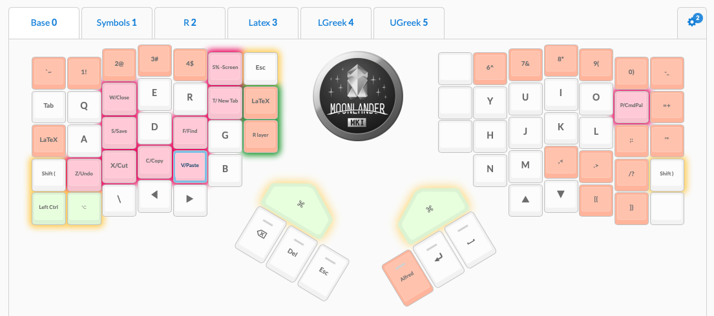
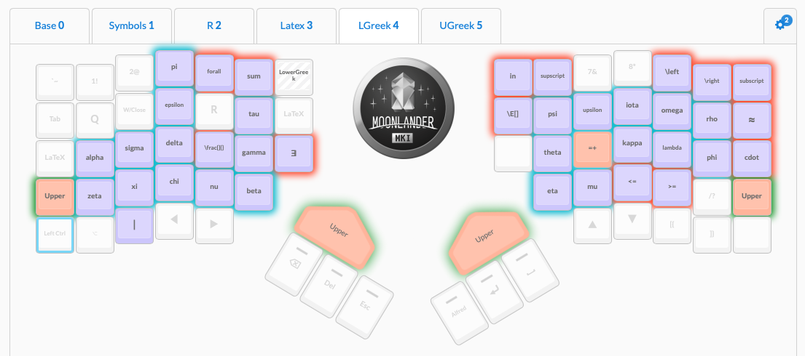

# RSI Github Note


I’ve had a long journey with repetitive strain injury (RSI). Over the years, this has involved experimenting with lots of different medicines, exercises, and technologies (both hardware and software).

Unfortunately for the world, attention to RSI has increased over the years. Fortunately for those who suffer from it, this has greatly increased the number of tools available.

Economists are often a step removed from the engineering community where these tools are more commonly visible. This post—*which is not a substitute for medical advice*—is a collection of what I’ve learned over the years about what works best and why for others in our community. I hope it helps!


<!-- MarkdownTOC autolink="true" -->

- [Medical](#medical)
- [Exercises](#exercises)
    - [Equipment](#equipment)
    - [Do exercises between breaks!](#do-exercises-between-breaks)
    - [Find compound exercises](#find-compound-exercises)
- [Hardware](#hardware)
    - [Keyboard Trays](#keyboard-trays)
    - [Keyboards](#keyboards)
        - [Key travel](#key-travel)
        - [Keyboard Actuation Force and Switch Types](#keyboard-actuation-force-and-switch-types)
        - [Split Keyboards](#split-keyboards)
        - [Tilting and Concavity](#tilting-and-concavity)
        - [Tenting](#tenting)
        - [Ortholinearity](#ortholinearity)
        - [Thumb Clusters](#thumb-clusters)
        - [Firmware](#firmware)
        - [Backlighting](#backlighting)
        - [DIY vs Consumer-grade](#diy-vs-consumer-grade)
        - [Recommendations](#recommendations)
        - [Re-learning to Type](#re-learning-to-type)
    - [Mice](#mice)
        - [Vertical Mice](#vertical-mice)
        - [Multiple Mice](#multiple-mice)
    - [Monitors](#monitors)
- [Software](#software)
    - [Source Code Editor](#source-code-editor)
    - [Text Expansion](#text-expansion)
    - [Accessibility Software](#accessibility-software)
- [Final Advice](#final-advice)

<!-- /MarkdownTOC -->


## Medical
This section is brief, as you should really see a physician. The main point emphasized here is that there are multiple forms of RSI. Identifying your type of pain and its source is important, both for treatment and saving you years of frustration.

Particularly common forms of RSI pertaining to typing include:

- Carpal Tunnel Syndrome - Numbness and tingling in the hand/arm caused by nerve compression *in the wrist*. This is often tested using an electromyogram.
- Thoracic Outlet Syndrome - Can resemble carpal tunnel. However, it is caused by nerve or vein compression near the collarbone. As a result, your recommended treatment will be different and less focused on your wrists themselves.
- De Quervain’s Tenosynovitis - Pain and swelling near the base of your thumb. Symptoms are a consequence of inflammation of the tendon sheath around your tendon. Caused by thumb and wrist overuse.
- Trigger Finger - Another form of tenosynovitis.
- Tendonitis - Inflammation of the tendon itself. Similar treatment and timeline as with tenosynovitis, which is focused primarily on rest and NSAIDs to bring down inflammation.
- Tendinosis - Non-inflammatory degeneration of the tendon’s collagen due to overuse. NSAIDs are less useful here, and recovery time is much longer. You need to encourage collagen formation through physical therapy and exercise instead of focusing on rest.    


Some helpful links for understanding these differences include:
- [Tendinitis or Tendinosis? Why the Difference Is Important, What Treatments Help – Health Essentials from Cleveland Clinic](https://health.clevelandclinic.org/tendinitis-tendinosis-difference-important-treatments-help/)
- [What Is the Difference Between Tendonitis, Tendinosis, and Tendinopathy?](https://www.sports-health.com/sports-injuries/general-injuries/what-difference-between-tendonitis-tendinosis-and-tendinopathy)
- [Tendinitis Versus Tendinosis: Important Differences For Rehab And Treatment – 𝗣𝗥𝗲𝗵𝗮𝗯](https://theprehabguys.com/tendinitis-versus-tendinosis-important-differences-for-rehab-and-treatment/)

A rarer issue to be aware of for those who suffer from RSI in many locations throughout the body is a variety of genetic disorders that impact collagen production. These diseases, like Stickler’s Syndrome or Ehlers-Danlos Syndrome, still benefit from treatments, but there’s a much lower chance you’ll get back to feeling 100% and there is no specific treatment for them so the focus is on pain management.

## Exercises
The most important point I can iterate in this section is to go to physical or occupational therapist at the beginning. They’ll be able to start you off at an exercise difficulty level appropriate to your injury.

What do I have to add to this?  A few points.

### Equipment
**Buy OT and PT equipment for your home** 

Great equipment that takes up minimal space includes:

+ Latex resistance bands
+ Roped resistance bands
+ A suspension trainer. (While a TRX is overpriced generally compared to competitors, its handles are much more friendly for those with hand pain.)
+ Therapy putty
+ Guasha scraping massager
+ [A flexbar](https://www.amazon.com/gp/product/B003XWXRYS/ref=ox_sc_saved_title_5?smid=ATVPDKIKX0DER&psc=1)

Physical therapists will often give you substitute exercises for home that avoid the need for specific tools. However, I’ve found that these exercises aren’t that effective by themselves. While buying home equipment isn’t cheap, it will save you the money and emotional defeat of going back to PT/OT in the long run.

### Do exercises between breaks!
Whether you are a theorist or empiricist, economists have lots of down time even when they are in front of a computer. We could be thinking through how to clean up a proof or waiting for an R file to finish running. Use these small blocks of time to squeeze in a set of exercises. This is especially easy if you keep tools like theraputty near your desk!

### Find compound exercises
Time pressure in academia is real. PTs and OTs will often start you off with isometric exercises to isolate and develop particular muscles. This is great at the beginning of therapy. However, to make your therapy regimen sustainable in the long run, and keep you from returning to PT/OT, ask them (or the internet) for compound exercises once you are further along. This way you can work on multiple muscle groups at the same time and not feel like your RSI is a second full time job.

## Hardware

### Keyboard Trays 

### Keyboards

Keyboards are likely how you got here. Before I recommend any particular keyboards, let’s get into features that can make a keyboard good versus bad for RSI.

#### Key travel
Thin keyboards are terrible for you. This is one reason why typing on a laptop is particularly bad. Why? Thin keyboards have limited ‘key travel’ and force you to “bottom out.” In other words, you have to press a key down all the way and have your finger feel the impact in order for a key to register. You know the feeling of when you jam your finger in basketball? It’s like you’re doing a very mild version of that to yourself thousands of times a day!

Unfortunately, even many ‘ergonomic’ keyboards from major brands, like the Logitech Ergo K860 or Microsoft Sculpt, have limited key travel.

Older desktops used to include mechanical keyboards. They were loud and clanky, but had lots of key travel. Get a mechanical keyboard.

Luckily for us, the mechanical keyboard market is  currently having a bit of a renaissance. However, the mechanical keyboard market doesn’t just exist for RSI sufferers. Some even consider the keyboards a hobby! While this means there are a lot of options in the space, it means you need to carefully choose the right keyboard for you.

#### Keyboard Actuation Force and Switch Types

One dimension in selecting your mechanical keyboard is picking the type of switch, which is the hardware under the keycap that your finger is exerting pressure onto. Mechanical keyboards have more key travel, and you don’t have to press them down all the way before they register a keypress. However, the type of switch you buy will dictate how the key feels when you press it.

There are 3 dimensions to picking a switch:

- **Linear versus Tactile** — Tactile keys feature a notable 'bump' as you press down on them. By contrast, linear key switches feel consistent throughout the downpress.
- **Actuation Force** — This is a physical measure of how much pressure you must apply to the key for it to generate a keypress. 
- **Clicky versus non-clicky** — Whether or not your key switch generates a 'click' sound and feeling when the keypress is registered. This feature has less to do with ergonomics and more to do with the psychology of how you process if you pressed a key correctly. 


Many on the internet consider Cherry MX Brown switches to be the best for those just getting into mechanical keyboards. They’re tactile but need a low actuation force, and they don’t make a loud click sound with key. [^1] 

[^1]: Cherry is the brand name for the keyboard switches. MX is the product line, used for most consumer purposes. Brown is the specific switch type. Other manufacturers make brown switches, but Cherry has the best reputation and widest adoption. 


I personally prefer Cherry Red keys, as they feel very light on your fingers. However, the lack of tactile feedback can be off-putting at first.

Note: Some mechanical keyboards are **hot-swappable**. This means that you can easily remove the switches and replace them with new ones. For example, you can switch from Cherry Brown to Cherry Red switches without buying a whole new keyboard.

#### Split Keyboards


Hold your arms straight out, then bend your elbows to 90 degrees. Notice how far apart your hands are from each other? Now think about how narrow your keyboard is by comparison!

Bunching up your body to type on a narrow keyboard can cause a variety of problems. Which issue arises depends on which part of your body you bunch up to compensate for the narrowness.


The solution to this problem is using a split keyboard. These keyboards create distance between the keys typically typed by your left hand and those typed by your right hand.


There are two forms of split keyboards:
- Adjustable split keyboards - These keyboards come in the form of two pieces, typically connected by cord. This format allows you to adjust the keyboard halves to be the right distance for you.
- Fixed split keyboards - This keyboard still comes in a single piece but left versus right hand keys are separated by a gap. 


Keeping your two halves shoulder width apart is ideal, which is why I prefer adjustable split keyboards. When you’re using your mouse a lot, this can be problematic because now your mouse is in a suboptimal location. I typically put an Apple Magic Trackpad between my two keyboard halves when programming and thus not using my keyboard heavily. When using my mouse more heavily, such as during internet browsing, I switch my right keyboard half and mouse back around so that my mouse is straight ahead of my right hand.

#### Tilting and Concavity


Ever notice those legs at the back of standard keyboards, which put your keyboard at an angle? Those are terrible for you.

Why? Remember that we want our wrists straight during typing, instead of being hunched. But, when typing, your fingers are curved downwards. This means that, ideally, your wrist rest is *higher* than where your keys are located. Thus, we actually prefer a negative tilt, where the side of the keyboard that is closer to you is higher than the back.

High end keyboard arm manufacturers offer arms that allow you to put your keyboard at a negative tilt. Examples include [Humanscale](https://www.humanscale.com/products/keyboard-systems/keyboard-systems), [iMovR](https://www.imovr.com/), Ergotron, and ESI. Many of these come in options compatible with adjustable height desks!

We can take considering key height to the extreme. Your home row keys should be the lowest keys for typing. However, due to how our fingers curve, the keys above and below can be taller. Some keyboard designs take this into account and use *concave key wells* to optimally raise each key.


#### Tenting
Ever notice that your hand is less tense in a ‘handshake’ position than it is laying flat? Keeping your palm vertically is considered a more neutral position.

(This is the same concept behind vertical mice, which we’ll get into later. We’re talking about keyboards!)


Keyboard *tenting* is when a keyboard is designed or adjusted so that the middle keys (think T, Y, G, and H) are located higher than the edge keys (like Tab or Shift). This is far from a vertical position, but the idea is that every little bit helps.

Some keyboards have a fixed amount of tenting, while others have legs or tenting kits that allow you to adjust the angle.

#### Ortholinearity
Notice how the keys on your keyboard aren’t vertically aligned? This staggering is to avoid jams, but in the post-typewriter era, that’s not necessary.

Further, it isn’t ergonomic. Your fingers would rather move straight up and down rather than diagonally, so let them. Ortholinear keyboards are based around this concept. They are designed so that keys are directly above and below one another, reducing the distance your finger must travel during typing. Ortholinearity is one of the more common features across ergonomic mechanical keyboards.




#### Thumb Clusters

Your thumb is one of your strongest fingers. Your pinky is one of your weakest. Yet, on a standard keyboard, we only assign thumbs to the space bar, thereby using our thumbs inefficiently. By contrast, we make our weak pinkies do lots of work, giving them the reigns to many symbols and modifier keys (i.e. Shift, Ctrl). This makes our pinkies work hard and our hands frequently stretch in unnatural ways. To make matters worse, this becomes a bigger issue if we make use of keyboard shortcuts to reduce typing as a way of coping with RSI!


To address this issue, some keyboard designs include thumb clusters, so that the thumb can be assigned more keys and be in charge of a greater share of typing duties. Sometimes these keys are pre-assigned to keys like Return or Enter. Sometimes they are empty so that you can assign your own command to them.

Thumb clusters are brilliant and one of the keyboard changes I most strongly recommend, especially to anyone doing lots of programming, whether its just making slides in Beamer or estimating a large structural model in R. Programming involves lots of keys like brackets \[\]  , slashes \\, and symbols = that non-programmers don’t use nearly as often. Moving these keys to your thumb will do wonders for the health of your hands.

#### Firmware

Like most people, I imagine you never tap your shift key. If you use it, you hold it while tapping another button. This is a waste of a key!

Luckily, many mechanical keyboards also have advanced software built into them so you can re-map keys. For example, when I tap but don’t hold my left shift key, my keyboard types a left parenthesis \(; the right shift key produces a right parenthesis \) to match!

The fun goes on from there. My page down key that I never use? My keyboard translates that keypress into a dplyr pipe operator %>%, which makes R programming much easier.

You can even get more extreme! Many keyboards even allow the use ‘layers’. Imagine assigning an unused key on your keyboard (perhaps CapsLock if you’re me) as your ‘toggle’ key. This toggle key will take you to another layer, where every key means something else. Consider my keyboard layout which includes both a base QWERTY layer and a special layer for LaTeX where a different greek letter is assigned to each key. This drastically cuts down on my slash \\ typing!






#### Backlighting

You may have seen pictures of keyboards like this by gamers where the lighting is purely for aesthetics:


However, this lighting underneath the keys can serve a practical purpose too! Many of the same keyboards that allow extensive firmware customization also allow you to program the lighting underneath each key, which can serve as a reminder of what each key is doing.

For example, in my LaTeX layer featured above, I have greek letters used for variables backlit by one color (blue) while math operators are backlit by another (orange).

#### DIY vs Consumer-grade

As I mentioned, mechanical keyboards have largely come back into fashion as a hobby. Thus, while there are an overwhelming number of mechanical keyboard layouts available these days, the vast majority can only be acquired by you if you order individual parts and solder the keyboard together yourself. Some even require you to 3D print certain parts! Beyond being a large time investment, it also means they don’t come with customer support in case something goes wrong.

While DIYing can be fine as a hobby, you may want something more dependable when using a keyboard for work. This is especially true when a deadline is looming! Luckily, some of the most popular ergonomic designs are available by companies that back their products with a warranty. Some even provide GUI frontends to keyboard firmware to make reconfiguring your keyboard more user-friendly.

#### Recommendations

That was a lot of material! Maybe you read it all and don’t know where to start. Maybe you’re just trying to skip to suggestions. Regardless, here is a table of the keyboards I recommend most to other economists. This list is based on ergonomics, our usage patterns, and ease of customer support.

| Keyboard           | Hot-Swappable      | Split              | Concave            | Tenting            | Ortholinear        | Thumb Clusters     | Programmable       | Backlighting       | Warranty |
| -----------------  | :----------------: | :----------------: | :----------------: | :----------------: | :----------------: | :----------------: | :----------------: | :----------------: | :------: |
| Kinesis Advantage2 | :x:                | :o: <br> Fixed     | :heavy_check_mark: | :o: <br> Fixed     | :heavy_check_mark: | :heavy_check_mark: | :o: <br>Limited    | :x:                | 3 years |
| Moonlander         | :heavy_check_mark: | :heavy_check_mark: | :x:                | :heavy_check_mark: | :heavy_check_mark: | :heavy_check_mark: | :heavy_check_mark: |:heavy_check_mark: | 2 years |
| Dactyl (DIY)       | :heavy_check_mark: | :heavy_check_mark: | :heavy_check_mark: | :heavy_check_mark: | :heavy_check_mark: | :heavy_check_mark: | :heavy_check_mark: |:heavy_check_mark: | None |


For development economists in particular, I strongly recommend getting the Moonlander as a travel keyboard. It is compact, making it an easy keyboard to bring with you on a trip to the field. Other economists may want to do the same if they travel frequently, such as for seminar visits. 

For daily typing, I often prefer the Kinesis due to its concave keywells, which I find to be a huge improvement in my ergonomics. Both the Kinesis and Moonlander are supported by great customer service and intuitive GUIs. The Moonlander is my preferred keyboard when working in LaTeX because it allows for keyboard layers, which the Kinesis does not.[^15] 

[^15]: The Kinesis can be modified to use the same QMK firmware that is behind the Moonlander. This enables the Kinesis to be fully programmable. However, this requires some hardware modification and will void your warranty. It also won't allow GUI access, so re-programming your keys will have to be done through editing the QMK firmware's source files. I don't recommend this to beginners. 

An important caveat: none of these keyboards are wireless. Unfortunately, wireless mechanical keyboards are still in a nascent stage, and involve a significant amount of DIYing. That said, new developments happen all the time, so feel free to take a look and see if things have changed. Better yet, let me know so I can get one too!

#### Re-learning to Type 

If you notice yourself getting much slower at typing after adopting a keyboard with one or more of these features, that is totally normal! The learning curve can be steep, but that isn't a reason to abandon ship. 

Luckily, there are a plethora of tools out there for re-teaching you to touch type on your new keyboard. Many of them are free! These tools will likely catch you up to speed in 1-2 weeks of consistent practice. In the meantime, no one is banning you from keeping your old, normal keyboard nearby!

The biggest barrier for adoption of a new keyboard to those of us who program is that our typing patterns can be a bit unique. While a non-programmer needs to focus on typing patterns for regular words, programmers care much more about special keys like punctuation that are used extensively by programming languages. 

To train yourself for programming specifically, I recommend [typing.io](http://typing.io). Their premium service, while not free, allows you to upload your own old code and practice re-creating your own software. This is as personalized as teaching gets! Further, the subscription is cheap and most users will only need 1 month of premium before they're back on track. 


### Mice

#### Vertical Mice

Remember how we discussed how the hand prefers being vertical or in 'handshake mode' when discussing keyboard tenting? Similar advice goes for mice! This is the idea behind vertical mice; they allow your hand to be in a more neutral position. 

Unfortunately, a lot of vertical mice have a really cheap hand feel, which can make them harder to use. I recommend the [Logitech MX Vertical](https://smile.amazon.com/Logitech-Vertical-Wireless-Mouse-Rechargeable/dp/B07FNJB8TT/). As a bonus, it features several programmable buttons that you can customize to save you extra keypresses. 

#### Multiple Mice

As the 'R' in RSI indicates, the symptoms arise from doing the same motion over and over again. One way to temper this is by having multiple, different types of mice that you switch between. I personally use a combination of:

- Apple Magic Trackpad
- Logitech MX Master 3
- Logitech MX Vertical
- An iPad and iPad Pencil for anything that can be conveniently done via tablet

I personally avoid trackballs because I don't like the lack of precision in controls. However, if you do decide to use a trackball, a common recommendation is to use a finger trackball like the [Kensington Expert](https://smile.amazon.com/dp/B01936N73I/). Finger trackballs are less prone to causing De Quervain’s Tenosynovitis than thumb trackballs, and their larger balls are also better suited towards modern high resolution screens. If you do use a thumb trackball, the [Logitech MX Ergo](https://smile.amazon.com/Logitech-Ergo-Wireless-Trackball-Mouse/dp/B0753P1GTS) allows you to optionally angle the mouse. While this angle isn't as extreme as a vertical mouse, it is a more neutral position than other trackballs provide. 

Overall, for most cases, I recommend minimizing mouse use as much as possible. A keyboard has a broader diversity of hand movement it requires. There's only so many ways to diversify using a mouse to avoid repetition. 

### Monitors

If you are a dual monitor user, get an ultra-wide monitor instead. It increases the amount of screen real estate directly in front of you, reducing the amount of neck swivelling you'll be doing all day. 

## Software 

### Source Code Editor

If you know how to use Emacs or Vim well, skip this section. These are great pieces of software, but often hard for new users to pick up.

For the rest of us, a source code editor is a major upgrade from the built in  editors for our tools of the trade such as R, Stata, or LaTeX. A good source code editor will have RSI-friendly features like:

- Syntax highlighting: This is a common feature that many built in editors also have. 
- Autocomplete: A good editor will not only autocomplete base language commands, but also commands from packages you've loaded in and functions you've defined earlier in your file. This can save you lots of typing in the long run. If you use a keyboard with a thumb cluster, moving the tab key to your thumb is a great pairing!
- Multiple Cursor support: Ever find yourself typing/editing the same thing on multiple lines of code? Many great source code editors will allow you to have 'multiple cursors' so that you can edit your file in multiple locations at once. This saves you the hassle of copy and pasting! It is also well paired with 'Find All', so you can select all instances of a string of text at once.
- Regex Find and Relace: If you've ever used fuzzy strings, you may be familiar with regular expressions. Great editors will allow you to enter regular expressions in the find and replace bar. When paired with multiple cursor support, this is a large time saver when you have many instances of similar but not duplicate code that you need to edit. 
- Snippet manager: Personally, I have many snippets of code that frequently arise throughout my projects. One example is doing a logit in R via 
    ```
    mylogit <- glm(y ~ x, data = mydata, family = 'binomial')
    ```
With a snippet manager, I can just type `logit`, press Tab, and the editor will write the line for me, and even let me tab through the variable names that I need to change. This is a boon for both my fingers and my memory. 


They'll also have many other features that aren't RSI related but very useful for your workflow. These topics are covered extensively elsewhere, so I won't get into them here. 


### Text Expansion

Text expansion software encompasses two forms of software. The first is more general automation software that also does text expansion. Examples include [Keyboard Maestro](https://www.keyboardmaestro.com/main/) on Mac and [AutoHotKey](https://www.imovr.com/) for Windows. The second group is software dedicated to text expansion specifically, such as [RocketTypist](https://www.witt-software.com/rockettypist/) or [TextExpander](https://textexpander.com). The latter is often more user-friendly, owing to its simplicity, while the former allows for a great deal of automation on your computer that can save you time once you master their steep learning curve. 

Regardless of which route you pursue, text expansion apps are useful because they allow you to avoid typing long, routine strings of text. This may sound familiar: I said the same of text editors that have built-in snippet managers! However, while those snippet managers will only expand text within your text editor, text expansion software will work in all apps across your computer, from your text editor for programming or your web browser for filling out forms. 

### Accessibility Software

Accessibility software, particularly voice recognition software, has come a long way. [Nuance Dragon](https://www.nuance.com/dragon/business-solutions/dragon-professional-individual.html) is the most popular tool in this category, and is used widely in a variety of industries. While there have been [creative attempts to adapt Dragon for programming](https://www.youtube.com/watch?v=8SkdfdXWYaI), they can feel unnatural because Dragon wasn't designed for a programming setting. The software is also only available on Windows.

My preferred tool for those with a bit of technical know-how is [Talon](https://talonvoice.com). It works for macOS, Linux, and Windows operating systems, is free, and can be customized via Python. The latter is an incredibly useful tool for easily creating verbal shortcuts for your common commands. I even combine these features with my text expansion software so that a few easy to say words can quickly replicate many keys worth of typing.

Talon also allows the use of eye tracking hardware as a substitute for using a mouse. I have not tried this feature, but users state that it works best on smaller screens of 24" or less. For those interested in trying out a similar feature, macOS has its own internal head tracking option within the accessibility settings. It works reasonably well as an alternative, especially in situations where precision isn't required, like web browsing. 


## Final Advice

Don't do too much at once or it will be hard to pick up. You're undoing years of habits and muscle memory. Fortunately, adjusting to most of these tools can happen in the course of mere days to at most a month. Introduce new tools one step at a time to reduce frustration and avoid feeling like your RSI is dictating your life. And, if you're reading this in the first place, the lesson you need to internalize the most is to go easy on yourself! 


